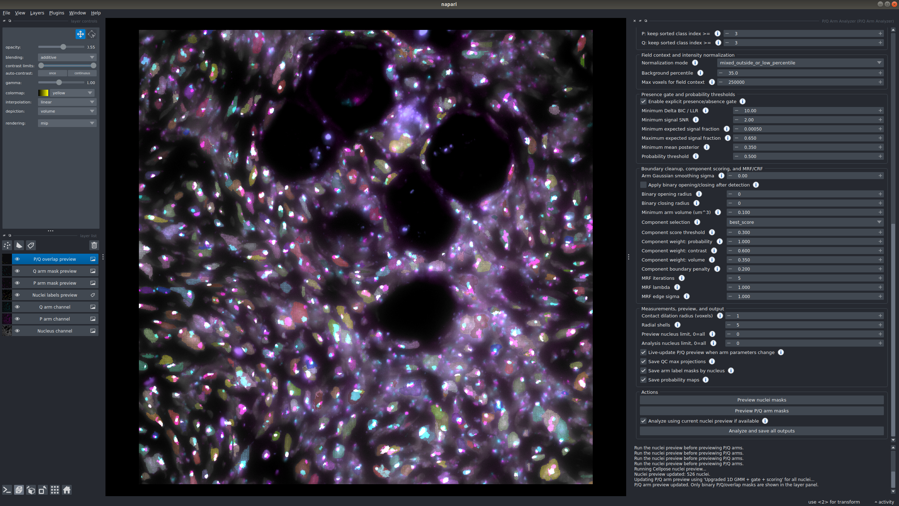

# Chromosome Territories: P/Q Arm Analyzer napari plugin



Interactive napari plugin for 3D nuclei segmentation, chromosome-territory P/Q arm detection, batch scene analysis, mask export, CSV measurement export, and summary plot generation from multi-channel microscopy images.

**GitHub repository**

```text
https://github.com/CBIIT/Chromosome_territories.git
```

**Author and repository owner**  
Adib Keikhosravi, Ph.D.  
Staff Scientist, Laboratory of Receptor Biology and Gene Expression, CCR, NCI  
National Institutes of Health  
Email: adib.keikhosravi@nih.gov

**License:** MIT License. See [`LICENSE`](LICENSE).

---

## Current version

**v0.3.5**

This version is a streamlined routine-analysis version. It keeps only the three P/Q arm-detection methods used for practical tuning:

```text
Legacy 1D GMM
Upgraded 1D GMM + gate + scoring
MRF/CRF refinement
```

It also includes:

- scene checkboxes for batch analysis;
- configuration save/load as JSON;
- simplified napari visualization layers;
- detailed parameter help buttons;
- expanded 3D shape/radial measurements;
- a public result table with internal tuning/debug columns removed;
- multi-format image loading for common microscopy formats.

---

## Repository name versus Python package name

The **GitHub repository** is named:

```text
Chromosome_territories
```

The current **Python package/distribution name** in `pyproject.toml` is:

```text
napari-pq-arm-analyzer
```

That means installation/uninstallation commands may still use `napari-pq-arm-analyzer`, while Git commands and directory paths use `Chromosome_territories`.

For example:

```bash
git clone https://github.com/CBIIT/Chromosome_territories.git
cd Chromosome_territories
python -m pip install -e .
```

To remove a previously installed editable version:

```bash
python -m pip uninstall -y napari-pq-arm-analyzer
```

---

## Main screenshot

The README image points to:

```text
docs/images/plugin_screenshot.png
```

Replace that file with a screenshot exported from the plugin, keeping the same filename, and GitHub will automatically show it at the top of this README.

---

## Full manual

A complete DOCX manual is included here:

```text
docs/manual/PQ_Arm_Analyzer_User_Manual_v0.3.5.docx
```

The manual contains the full step-by-step workflow, detailed explanations of every visible GUI parameter, tuning recipes, output-file descriptions, result-column explanations, mathematical formulas, and detailed appendices on MRF/CRF refinement and component selection.

---

## What the plugin does

The plugin provides an interactive workflow in napari:

1. Load a multi-channel microscopy image.
2. Select a scene, series, field, position, or tile.
3. Choose the nucleus, P-arm, and Q-arm channels.
4. Segment nuclei with Cellpose.
5. Detect P and Q arm territories inside each nucleus.
6. Preview the masks in napari.
7. Tune parameters using the live preview and the parameter help buttons.
8. Save a reusable configuration JSON.
9. Analyze one scene or multiple checked scenes.
10. Export masks, measurements, plots, QC files, and configuration files.

---

# Installation

This section gives complete installation steps starting from a clean machine or a clean conda environment.

The plugin is a napari plugin, so it should be installed into the **same Python environment that will launch napari**.

## 1. Install prerequisites

You need:

```text
Git
Conda or Mamba
Python 3.9 or newer
A working graphical desktop session for napari
```

Recommended: use a fresh conda environment rather than installing into an existing analysis environment.

### 1.1 Check Git

```bash
git --version
```

If Git is missing, install it with your system package manager or from the official Git installer.

On Ubuntu/Debian systems:

```bash
sudo apt-get update
sudo apt-get install -y git
```

### 1.2 Check conda

```bash
conda --version
```

If conda is not installed, install Miniconda or Anaconda. After installation, open a new terminal and run the command again.

### 1.3 Optional: install mamba

Mamba is optional but often solves conda environments faster:

```bash
conda install -n base -c conda-forge mamba -y
```

All commands below use `conda`. You can replace `conda` with `mamba` if preferred.

---

## 2. Create a fresh environment

Recommended environment name:

```text
chromosome-territories
```

Create and activate the environment:

```bash
conda create -n chromosome-territories python=3.9 -y
conda activate chromosome-territories
```

Upgrade basic Python build tools:

```bash
python -m pip install --upgrade pip setuptools wheel
```

Confirm that the terminal is using the environment you just created:

```bash
python --version
python -m pip --version
which python
```

On Windows, use:

```bash
where python
```

---

## 3. Install napari with a Qt backend

napari needs a Qt backend. The recommended pip route is:

```bash
python -m pip install "napari[pyqt5]"
```

If that command fails on your system, try installing napari and PyQt separately:

```bash
python -m pip install napari pyqt5
```

Verify that napari launches before installing the plugin:

```bash
napari
```

Close napari after confirming that the main window opens.

### Linux note for Qt/napari

If napari fails to open on Linux because Qt libraries are missing, install common desktop dependencies. On Ubuntu/Debian systems, this may help:

```bash
sudo apt-get update
sudo apt-get install -y libxcb-xinerama0 libxcb-icccm4 libxcb-image0 libxcb-keysyms1 libxcb-render-util0 libxkbcommon-x11-0
```

Then try:

```bash
napari
```

---

## 4. Decide whether you need CPU or GPU Cellpose

The plugin uses Cellpose for nuclei segmentation. Cellpose uses PyTorch internally.

### 4.1 CPU-only installation

For CPU-only use, no special GPU setup is required. Installing the plugin will install Cellpose and its Python dependencies.

This is the simplest installation path and is recommended for first-time testing.

### 4.2 GPU installation

For GPU acceleration, install a PyTorch build compatible with your NVIDIA driver and CUDA setup before installing the plugin. The exact PyTorch command depends on your workstation and CUDA version.

After installing a GPU-enabled PyTorch build, confirm:

```bash
python -c "import torch; print('CUDA available:', torch.cuda.is_available()); print('torch:', torch.__version__)"
```

You want:

```text
CUDA available: True
```

If CUDA is not available, the plugin can still run with CPU Cellpose, but nuclei segmentation will usually be slower.

---

## 5. Clone the repository from GitHub

Clone the repository from the CBIIT GitHub organization:

```bash
git clone https://github.com/CBIIT/Chromosome_territories.git
cd Chromosome_territories
```

If the repository is private, make sure you are logged in with GitHub credentials or have configured SSH access.

### Alternative SSH clone

If your GitHub account is configured for SSH access:

```bash
git clone git@github.com:CBIIT/Chromosome_territories.git
cd Chromosome_territories
```

### Alternative: install from a downloaded ZIP

If you downloaded the repository ZIP from GitHub:

```bash
unzip Chromosome_territories-main.zip
cd Chromosome_territories-main
```

If your ZIP extracts to a different folder name, `cd` into that extracted repository folder.

---

## 6. Install the plugin

From the repository root, install the plugin into the active conda environment.

Recommended editable installation:

```bash
python -m pip install -e .
```

Editable mode means that Python uses the code directly from this folder. This is convenient for development and for updating the plugin without repeatedly copying files.

### Install with optional file readers

For broader microscopy file support, install optional reader packages:

```bash
python -m pip install -e ".[extra-readers]"
```

This optional group installs support packages for LIF, ND2, and IMS fallback loading when available:

```text
readlif
nd2reader
imaris-ims-file-reader
```

If one optional reader fails to install on your system, you can still install the base plugin:

```bash
python -m pip install -e .
```

Then install optional readers individually as needed:

```bash
python -m pip install readlif
python -m pip install nd2reader
python -m pip install imaris-ims-file-reader
```

---

## 7. Verify the installation

Confirm that the package can be imported:

```bash
python -c "import napari_pq_arm_analyzer; print(napari_pq_arm_analyzer.__version__)"
```

Confirm that napari sees the plugin:

```bash
napari
```

Then open the widget from the napari menu:

```text
Plugins > P/Q Arm Analyzer > P/Q Arm Analyzer
```

If the plugin does not appear, try closing napari and running:

```bash
python -m pip install -e . --force-reinstall
napari
```

---

## 8. Clean reinstall or update

Use this when switching branches, updating the repository, or replacing an older plugin version.

From inside the repository:

```bash
conda activate chromosome-territories
cd Chromosome_territories

git pull
python -m pip uninstall -y napari-pq-arm-analyzer
python -m pip install -e .
napari
```

If you installed from a ZIP instead of GitHub, download the newer ZIP, extract it, and run:

```bash
conda activate chromosome-territories
cd Chromosome_territories-main

python -m pip uninstall -y napari-pq-arm-analyzer
python -m pip install -e .
napari
```

---

## 9. Uninstall

To remove the plugin from the active environment:

```bash
conda activate chromosome-territories
python -m pip uninstall -y napari-pq-arm-analyzer
```

To remove the whole conda environment:

```bash
conda deactivate
conda remove -n chromosome-territories --all -y
```

---

# Supported image formats

The plugin uses AICSImageIO first when possible, with fallback readers for common file types. Supported paths include:

```text
.lif
.czi
.nd2
.ims
.ome.tif / .ome.tiff
.tif / .tiff
.lsm
.zarr
```

Files with multiple scenes, series, fields, positions, or tiles are exposed as selectable scenes. You can load one scene for interactive preview and check multiple scenes for batch analysis.

Optional reader packages improve support for some file types:

```bash
python -m pip install readlif nd2reader imaris-ims-file-reader
```

---

# Quick workflow

1. Launch napari and open the plugin.
2. Click **Load image...**.
3. Select a preview scene and click **Load selected scene for preview**.
4. Set the nucleus, P-arm, and Q-arm channel numbers.
5. Tune nuclei segmentation and click **Preview nuclei masks**.
6. Choose one of the three P/Q arm detection methods.
7. Tune arm-detection parameters and click **Preview P/Q arm masks**.
8. Choose an output folder.
9. Optionally save the current configuration.
10. Optionally check multiple scenes for batch analysis.
11. Click **Analyze and save all outputs**.

---

# Configuration files

The GUI provides:

```text
Save configuration...
Load configuration...
```

A configuration JSON stores current parameter values, UI options, output folder, image path, preview scene, and checked scene indices.

Every analysis result folder also receives:

```text
pq_arm_analyzer_configuration.json
analysis_parameters.json
```

Batch analysis additionally saves:

```text
batch_pq_arm_analyzer_configuration.json
```

Recommended practice:

- Save a configuration after tuning on a representative scene.
- Reuse that configuration for batch analysis of related scenes.
- Keep the saved configuration with the exported masks and CSV files for reproducibility.

---

# Visible P/Q arm detection methods

## Legacy 1D GMM

Intensity-only baseline. A Gaussian mixture model is fitted inside each nucleus, classes are sorted from dimmest to brightest, and selected bright classes are used as the arm mask.

Use it when the P/Q signal is clean and bright. Avoid relying on it when nuclei may contain no true P/Q signal, because an intensity-only GMM can still divide noise into dim and bright classes.

## Upgraded 1D GMM + gate + scoring

Recommended starting method. It adds field-level intensity normalization, a presence/absence gate, probability thresholding, and connected-component scoring.

This helps prevent false-positive P/Q masks in nuclei where the arm channel contains only background or noise.

## MRF/CRF refinement

Boundary-refinement method. It starts from the upgraded GMM probability map and encourages neighboring voxels to agree while respecting image edges.

Use it when the upgraded method finds the correct general region but the boundary is ragged, speckled, fragmented, or has small holes.

---

# GUI simplification in v0.3.5

Several advanced internal controls were removed from the GUI and fixed at conservative backend defaults. This keeps the interface focused on parameters that usually need user tuning:

```text
channels
nuclei model and size/downsampling
scene batching
GMM class selection
field normalization
presence-gate thresholds
probability thresholding
component selection
MRF/CRF boundary refinement
measurement/output options
```

The fixed backend defaults are still recorded in the configuration and parameter JSON files for reproducibility.

---

# Napari layers shown

Raw scene layers:

```text
Nucleus channel
P arm channel
Q arm channel
```

Preview/result layers:

```text
Nuclei labels preview
P arm mask preview
Q arm mask preview
P/Q overlap preview
```

The P, Q, and overlap masks are Image layers, so colormap/color changes should behave like raw image channels. The nuclei layer remains a Labels layer because it stores object identities.

---

# Main output files

A single-scene analysis writes:

```text
nuclei_labels_3d.tif
p_arm_mask_3d.tif
q_arm_mask_3d.tif
pq_overlap_mask_3d.tif
p_arm_probability_3d.tif                 # if Save probability maps is enabled
q_arm_probability_3d.tif                 # if Save probability maps is enabled
p_arm_labels_by_nucleus_3d.tif           # if Save arm label masks is enabled
q_arm_labels_by_nucleus_3d.tif           # if Save arm label masks is enabled
pq_overlap_labels_by_nucleus_3d.tif      # if Save arm label masks is enabled
series7_chrX_arm_measurements_per_nucleus.csv
series7_chrX_arm_measurements_population_summary.csv
analysis_parameters.json
pq_arm_analyzer_configuration.json
arm_intensity_context.json
qc_nuc_maxproj.tif                       # if Save QC max projections is enabled
qc_p_maxproj.tif                         # if Save QC max projections is enabled
qc_q_maxproj.tif                         # if Save QC max projections is enabled
qc_nuclei_labels_maxproj.tif             # if Save QC max projections is enabled
plots/*.png
plots/plot_summary.txt
```

For batch analysis, each checked scene is saved into its own scene-specific output folder, and the batch-level configuration file is saved in the selected output root folder.

---

# Public result table

The public per-nucleus CSV keeps the most useful image-analysis measurements:

```text
nucleus identifiers
nucleus volume
P and Q arm volumes
P and Q volume fractions
P/Q overlap volume
P/Q overlap normalized to P and Q
P/Q contact
minimum P/Q edge-to-edge distance
P and Q centroids
3D radial-position measurements
3D shape measurements
```

Internal tuning/debug columns are intentionally omitted from the public CSV. Removed columns include field-background medians/MADs, presence-gate diagnostics, BIC/LLR diagnostics, GMM means, component diagnostic scores, selected bounding-box dimensions, selected raw distance-transform values, and the requested shell-1 fraction columns.

See the manual for a detailed explanation of every remaining result column and how it is calculated.

---

# Plots

The plot set includes summary figures for:

```text
arm volume fraction
P/Q overlap
contact frequency
minimum edge distance
P versus Q volume
mean arm volume versus overlap
centroid separation
radial centroid position
shape/sphericity summaries when the required columns are present
```

Plots associated only with removed diagnostic columns are not generated in this version.

---

# Recommended starting settings for large 3D images

For initial tuning on large multi-slice images, start with settings that reduce computational cost while preserving the main object structure:

```text
Nuclei segmentation mode: Cellpose 2D stack batch + overlap stitch
XY downsample factor: 2.0
2D batch size: 8
Worker count: 0
Backend: threading
Preview nucleus limit: 10 to 25
Arm method: Upgraded 1D GMM + gate + scoring
Max GMM components: 2
P/Q sorted class index: 1
Probability threshold: 0.50
Binary morphology: off
```

After the preview looks good, set **Analysis nucleus limit** to 0 and run the full analysis.

---

# Troubleshooting

## The plugin does not appear in napari

Make sure napari is launched from the same environment where the plugin was installed:

```bash
conda activate chromosome-territories
python -m pip show napari-pq-arm-analyzer
napari
```

If needed, reinstall:

```bash
python -m pip uninstall -y napari-pq-arm-analyzer
python -m pip install -e .
```

## napari opens, but the plugin crashes when launched

Run napari from a terminal so that the full error message is visible:

```bash
conda activate chromosome-territories
napari
```

Then open:

```text
Plugins > P/Q Arm Analyzer > P/Q Arm Analyzer
```

Copy the terminal traceback if you need to report the issue.

## Cellpose is slow

Try:

```text
Use Cellpose 2D stack batch + overlap stitch
Increase XY downsample factor for preview
Use GPU if available
Use a small Preview nucleus limit while tuning
Disable live P/Q preview and click preview manually
```

## GPU is not detected

Check PyTorch:

```bash
python -c "import torch; print(torch.cuda.is_available()); print(torch.__version__)"
```

If this prints `False`, install a PyTorch build compatible with your NVIDIA driver/CUDA setup, or run Cellpose on CPU.

## Optional image formats do not open

Install the optional readers:

```bash
python -m pip install readlif nd2reader imaris-ims-file-reader
```

Then restart napari.

## Mask color does not change as expected

The P arm, Q arm, and P/Q overlap previews are Image layers and should respond to colormap changes. The nuclei preview is a Labels layer and uses label-color behavior rather than image-colormap behavior.

---

# Development notes

This repository is structured as a standard editable Python package:

```text
Chromosome_territories/
    README.md
    LICENSE
    CHANGELOG.md
    pyproject.toml
    MANIFEST.in
    src/napari_pq_arm_analyzer/
        __init__.py
        _widget.py       # napari GUI and parameter handling
        analysis.py      # nuclei segmentation, arm detection, measurements, outputs
        help_text.py     # GUI help text
        image_io.py      # image/scene loading
        plotting.py      # summary plot generation
        napari.yaml      # napari plugin manifest
    docs/manual/
        PQ_Arm_Analyzer_User_Manual_v0.3.5.docx
    docs/images/
        plugin_screenshot.png
    examples/
        launch_widget.py
```

## Launching the widget during development

After installing in editable mode:

```bash
conda activate chromosome-territories
cd Chromosome_territories
python -m pip install -e .
napari
```

Or run the example script:

```bash
python examples/launch_widget.py
```

## Checking the package

Basic import check:

```bash
python -c "import napari_pq_arm_analyzer; print('import ok')"
```

Editable install check:

```bash
python -m pip show napari-pq-arm-analyzer
```

---

# Citation and attribution

The repository author/owner information appears at the top of each Python file and at the beginning of the manual. The repository is distributed under the MIT License.

**Author**  
Adib Keikhosravi, Ph.D.  
Staff Scientist, Laboratory of Receptor Biology and Gene Expression, CCR, NCI  
National Institutes of Health  
Email: adib.keikhosravi@nih.gov

